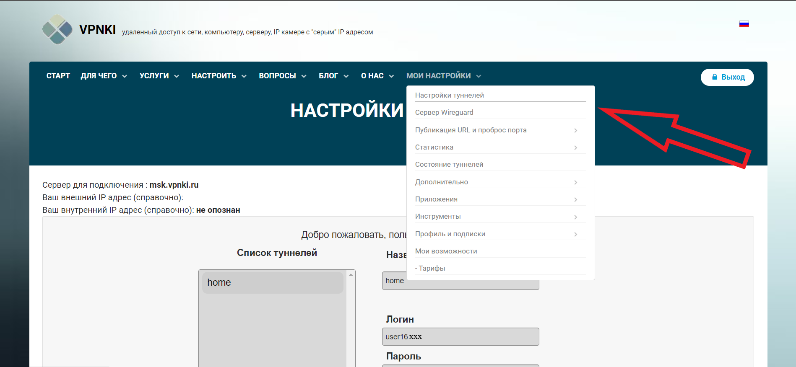

# Инструкция по настройке PPTP соединения между сервисом VPNKI и роутером Xiaomi mi Router 4C на OS OpenWrt 22.03.4 r20123-38ccc47687

1. Регистрируемся на сайте VPNKI и оплачиваем тариф либо активируем тестовый период.
2. Переходим в "Мои настройки" -> "Настройка туннелей".



3. Вводим название туннеля любое, какое хотите. Логин выдадут автоматически, вводим пароль, который будем указывать в маршрутизаторе при создании соединения позже. Ставим галочку "Настроить маршрут" и вводим ip address при помощи которого Вы подключаетесь к веб интерфейсу роутера. Например 192.168.1.0 или 192.168.0.0. Маску указываем /24 и нажимаем кнопку "Сохранить".
4. Переходим к настройкам маршрутизатора.
5. Заходим в меню "Software".
6. Проверяем наличие пакета ppp-mod-pptp и kmod-nf-nathelper-extra и в случае их отсутствия установливаем.
7. Переходим в меню Network -> Interface. После чего создаем новое подключение "Add new interface". Название интерфейса можете вводить любое, протокол нужно выбрать PPtP. Если после установки нужных пакетов Вы не можете выбрать протокол PPtP перезагрузите роутер. 
8. В поле VPN Server вводим "msk.vpnki.ru" или то, что будет указано в поле "Cервер для подключения" на сайте VPNKI в меню "Настройка туннелей".
9. В поле username и password вводим выданный нам логин и наш пароль.
10. Переходим на вкладку "Advanced Settings". Ставим "Obtain IPv6 address" на "Disabled" и убираем галочку с поля "Use default gateway" и нажимаем сохранить.
11. Подключаемся по SSH к маршрутизатору и в файле /etc/ppp/options.pptp необходимо закомментировать строку: mppe required,no40,no56,stateless. Комментируем её и всё)
Если файл отличается в других строках, то ничего страшного.

```
noipdefault
noauth
nobsdcomp
nodeflate
idle 0
#mppe required,no40,no56,stateless
nomppe
maxfail 0
#refuse-eap
```
### После этих пунктов перезагружаем интерфейс, который мы создали и если он всё же не заработал, то создаем файл /etc/sysctl.d/local.conf и прописываем туда строку после чего перезагружаем роутер.
`
net.netfilter.nf_conntrack_helper = 1
`
 
